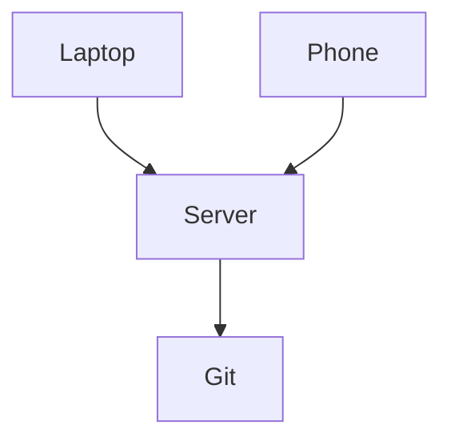
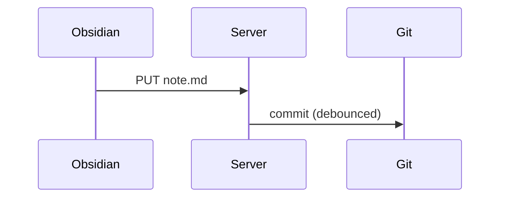

# Syntax highlighting

```go
func main() { fmt.Println("hello") }
```

```python
def f(x): return x * 2
```

```
#alsonotatag — plain block, no language
```

# Mermaid


```mermaid
graph TD; Laptop-->Server; Phone-->Server; Server-->Git;
```


```mermaid
sequenceDiagram
  Obsidian->>Server: PUT note.md
  Server->>Git: commit (debounced)
```
