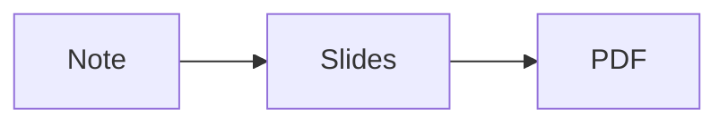

# A deck of slides

Written the Obsidian way

---

## How it works

- A line of `---` with a blank line before and after it ends a slide
- *Slide show* in the footer of the note opens it; so does `gs`
- Arrow keys, Space, `h` `j` `k` `l`, a click or a swipe change slides
- `f` is full screen, `q` leaves, `?` lists the keys

---

## Code and a picture

```go
func main() { fmt.Println("slides") }
```

![[dot.png|120]]

---

## A diagram



---

## A table

| Format | Pages |
|---|---|
| Book | as many as the text needs |
| Slides | one a slide |

---

## Too much for one slide

What does not fit is made smaller, not cut off:

- point 1: a line that is long enough to take its share of the width of a slide
- point 2: a line that is long enough to take its share of the width of a slide
- point 3: a line that is long enough to take its share of the width of a slide
- point 4: a line that is long enough to take its share of the width of a slide
- point 5: a line that is long enough to take its share of the width of a slide
- point 6: a line that is long enough to take its share of the width of a slide
- point 7: a line that is long enough to take its share of the width of a slide
- point 8: a line that is long enough to take its share of the width of a slide
- point 9: a line that is long enough to take its share of the width of a slide
- point 10: a line that is long enough to take its share of the width of a slide
- point 11: a line that is long enough to take its share of the width of a slide
- point 12: a line that is long enough to take its share of the width of a slide
- point 13: a line that is long enough to take its share of the width of a slide
- point 14: a line that is long enough to take its share of the width of a slide
- point 15: a line that is long enough to take its share of the width of a slide
- point 16: a line that is long enough to take its share of the width of a slide
- point 17: a line that is long enough to take its share of the width of a slide
- point 18: a line that is long enough to take its share of the width of a slide

---

## Not separators

> A rule inside a quote is a rule:
>
> ---
>
> and the quote goes on.

A line of dashes right under a line of text makes it a heading instead:

Like this one
---

---

# The end

*Export to PDF* has a **Slides** format: one slide a page.
